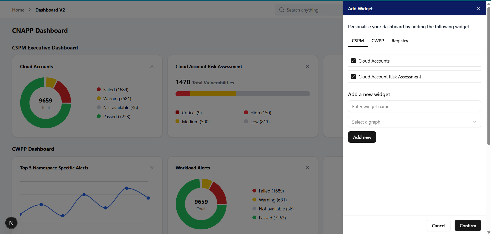

# Dashboard Frontend



A modern, responsive dashboard application built with Next.js for data visualization and monitoring.

**Live Demo:** [https://dashboard-frontend-eta-lilac.vercel.app/dashboard](https://dashboard-frontend-eta-lilac.vercel.app/dashboard)

## Features

- **Interactive Dashboard**: Real-time visualization of metrics and data
- **Widget Management**: Add, remove, and organize various chart widgets
- **Multiple Chart Types**: 
  - Pie Charts for categorical data
  - Line Graphs for trend analysis
  - Horizontal Bar Graphs for comparative data
- **Category Organization**: Organize widgets into different categories
- **Search Functionality**: Find specific widgets quickly
- **Dark/Light Theme**: Toggle between themes for better user experience
- **Responsive Design**: Works seamlessly across desktop and mobile devices

## Tech Stack

- **Framework**: Next.js 15.5.2 with App Router
- **UI Library**: Radix UI components
- **Styling**: Tailwind CSS 4
- **State Management**: Redux Toolkit
- **Charts**: Recharts
- **Icons**: Lucide React
- **Theme**: next-themes for dark/light mode

## Getting Started

### Prerequisites

- Node.js 18+ 
- npm, yarn, pnpm, or bun

### Installation

1. Clone the repository:
```bash
git clone <repository-url>
cd dashboard-frontend-main
```

2. Install dependencies:
```bash
npm install
# or
yarn install
# or
pnpm install
# or
bun install
```

3. Run the development server:
```bash
npm run dev
# or
yarn dev
# or
pnpm dev
# or
bun dev
```

4. Open [http://localhost:3000](http://localhost:3000) with your browser to see the dashboard.

The application will automatically redirect to the dashboard page at `/dashboard`.


## Project Structure

```
src/
├── app/
│   ├── Components/
│   │   ├── AddWidget/          # Widget addition modal
│   │   ├── Categories/         # Category management
│   │   ├── HorizontalBargraph/ # Bar chart component
│   │   ├── Layout/            # Layout components
│   │   ├── LineGraph/         # Line chart component
│   │   ├── ModeToggle/        # Theme toggle
│   │   ├── Navbar/            # Navigation bar
│   │   ├── PieChartGraph/     # Pie chart component
│   │   └── ThemeProvider/     # Theme context provider
│   ├── dashboard/             # Main dashboard page
│   ├── redux/                 # Redux store and slices
│   └── globals.css           # Global styles
├── components/
│   └── ui/                   # Reusable UI components
└── lib/
    └── utils.js              # Utility functions
```

## Key Components

### Dashboard Features
- **Add Widget**: Click the "Add Widget" button to add new chart widgets
- **Categories**: Organize widgets into different categories
- **Search**: Use the search functionality to find specific widgets
- **Theme Toggle**: Switch between light and dark themes
- **Time Range**: Select different time ranges for data visualization

### Chart Types
1. **Pie Charts**: Display categorical data distribution
2. **Line Graphs**: Show trends over time
3. **Horizontal Bar Graphs**: Compare different metrics

## State Management

The application uses Redux Toolkit for state management with the following structure:
- **Widgets Slice**: Manages widget data, categories, and search results
- **Store**: Centralized state management

## Styling

- **Tailwind CSS 4**: Utility-first CSS framework
- **Responsive Design**: Mobile-first approach
- **Dark Mode**: Full dark/light theme support
- **Custom Components**: Styled with Radix UI primitives